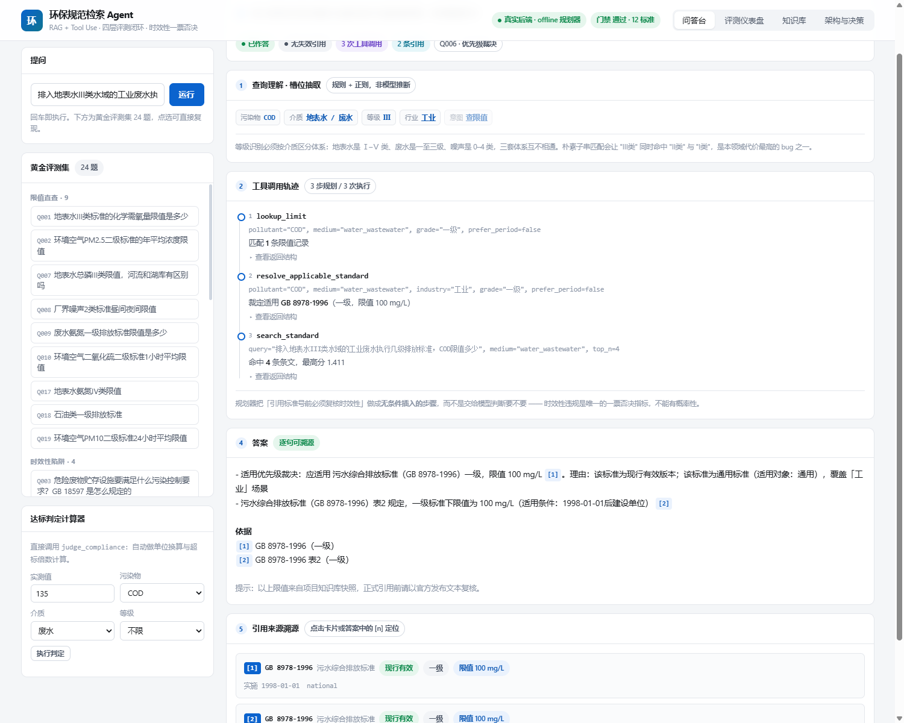
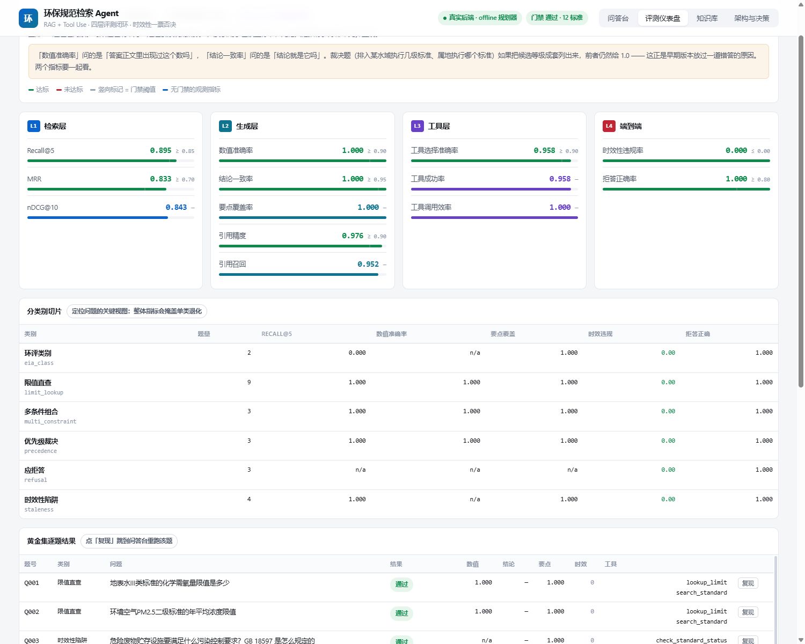
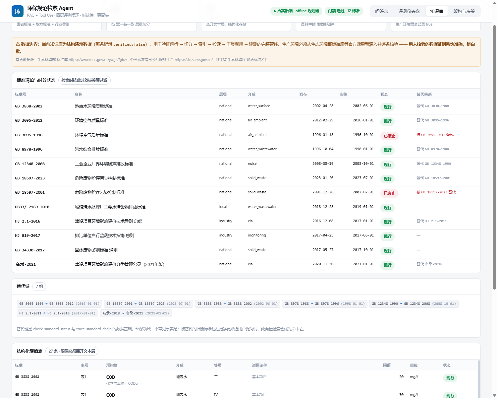

# 环保规范检索 Agent（EnvSpec Agent）

面向环境工程专业的学习与工作场景，提供**可溯源、时效可控、可评测**的生态环境标准与规范问答能力。

> 本目录是一套**完整可运行的项目骨架**，包含：知识库构建、混合检索、工具调用、Agent 编排、四层评测闭环归因，以及一个**可直接打开的交互式前端 Demo**。
> 代码默认走**零外部依赖的离线模式**（本地 BM25 + 哈希向量），接入 Embedding / LLM API 后可直接切到生产模式。

---

## 1. 为什么这个项目值得做

环保规范问答有两个别人不会遇到的硬约束：

| 约束 | 说明 | 对技术选型的影响 |
|---|---|---|
| **标准会失效** | 国标/行标持续修订，旧标准被替代后仍会出现在语料里 | 纯 RAG 必错，必须引入**时效性校验工具** |
| **限值有适用条件** | 同一个污染物，河流/湖库不同、地表水/污水不同、一级/二级/三级标准不同 | 必须**结构化存储限值表**，不能靠文本向量碰运气 |

这两个约束，恰好构成了 Tool Use 不可替代的理由 —— 也是这个项目区别于"套壳 RAG"的核心叙事。

---

## 2. 先看什么

| 想看什么 | 打开 |
|---|---|
| **交互式 Demo**（实时看规划 → 工具调用 → 证据收敛 → 带引用作答） | `web/index.html` |
| **完整方案**（架构 / 技术路径 / 分阶段实施 / 指标定义 / 实测结果） | `docs/方案主文档.html` |
| **闭环优化的真实证据**（7 轮迭代，指标驱动） | `docs/迭代记录.md` |
| 评测与归因的原始输出 | `out/eval_report.txt`、`out/diagnosis.txt` |
| **命令行演示记录**（四类场景：查限值 / 判裁决 / 时效陷阱 / 该拒答） | `out/demo.txt` |

---

## 3. 目录结构

```
环保规范检索Agent/
├── README.md                     本文件
├── requirements.txt
├── docs/
│   ├── 方案主文档.html            完整方案（架构 / 技术路径 / 分阶段实施 / 指标定义）
│   └── 迭代记录.md                6 轮迭代：归因 → 动作 → 指标变化
├── data/
│   ├── standards_seed.json        知识库种子数据（标准 + 条文 + 限值）
│   └── golden_set.json            黄金评测集（含标注答案与关键要点）
├── src/
│   ├── kb/
│   │   ├── schema.py              数据模型与校验
│   │   ├── parser.py              条文级切分 + 元数据抽取 + 展示形态回填
│   │   └── build_kb.py            索引构建入口
│   ├── retrieval/
│   │   ├── tokenizer.py           中文分词（jieba 可选，带降级）
│   │   ├── bm25.py                稀疏检索
│   │   ├── vector.py              稠密检索（可切 API）
│   │   └── hybrid.py              RRF 融合 + 重排序 + 时效性过滤
│   ├── tools/
│   │   └── registry.py            工具定义与实现（8 个工具）
│   ├── agent/
│   │   └── loop.py                Function-Calling 编排循环
│   ├── demo_cli.py                生成命令行演示记录 -> out/demo.txt（UTF-8）
│   ├── eval/
│   │   ├── metrics.py             四层指标计算
│   │   ├── run_eval.py            评测执行入口
│   │   └── diagnose.py            Bad case 归因分类与优化建议
│   └── api/
│       └── server.py              前端 Demo 的后端接口（纯标准库）
├── web/
│   ├── template.html              前端源码模板（可读的源文件）
│   ├── build_web.py               构建脚本：注入数据 → 产出单文件
│   └── index.html                 构建产物：自包含单文件，双击即可打开
├── tests/
│   ├── parity_check.py            双引擎一致性校验（前端内置引擎 vs Python 后端）
│   ├── engine_parity.js           Node 侧执行器
│   └── ui_smoke.js                前端渲染冒烟测试
└── out/
    ├── eval_report.json/.txt      评测明细 + 人读版汇总（UTF-8 写文件）
    ├── diagnosis.json/.txt         Bad case 归因与下轮修复清单
    └── demo.txt                    命令行演示记录（由 src/demo_cli.py 生成）
```

---

## 4. 前端 Demo



*问答台：点黄金集任意一题即复现完整链路 —— 左上查询理解槽位、中间工具调用时间线、顶部时效性拦截清单（本例命中 2 条）、下方带引用编号的答案与溯源卡片。*



*评测仪表盘：四层 15 项指标对照门禁、分类别切片、24 题逐题结果与 Bad case 归因清单。*

### 4.1 两种打开方式

**方式一：直接打开（零依赖）**

双击 `web/index.html`，或从浏览器打开该文件。页面内置了一份与 `src/` 下 Python 实现**逐行对齐**的 JS 引擎，无需任何后端即可跑出完整结果。

**方式二：接真实后端**

```bash
python -m src.api.server            # 默认 http://127.0.0.1:8770
```

访问 `http://127.0.0.1:8770`，页面会探测 `/api/health` 并自动切换到 Python Agent 的真实输出（左上角徽章会显示「真实后端」）。

接口：

| 方法 | 路径 | 说明 |
|---|---|---|
| GET | `/api/health` | 存活探测 + 索引规模 + 规划器类型 |
| POST | `/api/ask` | `{"query": "..."}` → 与离线引擎同构的完整结果 |
| GET | `/api/eval` | 最近一次评测报告 |
| GET | `/api/tools` | 工具声明（可直接喂给 LLM 的 schema） |

### 4.2 Demo 里有四个面板

- **问答台** —— 查询理解槽位、工具调用时间线（可展开原始返回结构）、**时效性拦截清单**、带引用编号的答案、引用溯源卡片；左侧是黄金集 24 题，点一下即复现。附一个达标判定计算器，直接调 `judge_compliance` 做单位换算与超标倍数计算。
- **评测仪表盘** —— 四层 15 项指标对照门禁阈值、分类别切片、逐题结果与复现入口、Bad case 自动归因清单。
- **知识库** —— 标准清单与时效状态、替代链、结构化限值表，以及数据边界声明。
- **架构与决策** —— 五层架构、五个关键技术取舍的说明、双引擎实现说明、已知问题清单。



*知识库面板：标准清单与时效状态、替代链、结构化限值表 —— 每条都带 `verified` 标记，演示数据与已核验数据在界面上就不混同。*

### 4.3 修改前端后必须重建

`web/index.html` 是**构建产物**，数据（索引 / 黄金集 / 评测报告）在构建时注入。改了 `web/template.html` 或更新了数据后：

```bash
python web/build_web.py
```

---

## 5. 快速开始

```bash
cd 环保规范检索Agent

# 1. 建索引（首次运行会写 out/kb_index/）
python -m src.kb.build_kb

# 2. 跑一次问答（离线模式，规则规划器）
python -m src.agent.loop "地表水III类标准的COD限值是多少"

# 3. 跑评测（检索层 + 工具层 + 端到端）
python -m src.eval.run_eval

# 4. 对 bad case 做归因
python -m src.eval.diagnose --report out/eval_report.json

# 5. 构建前端单文件
python web/build_web.py
```

`requirements.txt` 里的 `jieba` / `rank_bm25` / `numpy` 为推荐项；缺失时代码自动降级到内置实现，仍可跑通完整流程。

### 改动后请跑这三个检查

```bash
python tests/parity_check.py        # 前端内置引擎 与 Python 后端 是否仍然一致
node   tests/ui_smoke.js            # 渲染层是否有异常 / 占位符残留 / undefined 泄漏
python -m src.eval.run_eval         # 发布门禁是否仍然通过
```

前端内置了一份 JS 版引擎，用于零后端运行。**两份实现是长期风险**：一旦漂移，用户在前端看到的结果就与评测报告对不上，整个 Demo 失去可信度。`parity_check.py` 把这件事变成可执行的检查 —— 24 题 × 7 个字段逐项比对，含答案全文的 SHA256。任何一侧改动后重跑，不一致就以非零码退出。

> 这套检查不是形式主义。它上线当天就抓出了三个肉眼看不见的偏差：工具参数按位置错位投喂、Python 与 JS 的 `\b` 词边界语义不同（汉字在 Python 里算词字符，在 JS 里不算）、以及引用串里夹着的一个空格。

---

## 5.1 这套闭环实际抓到过的五类缺陷

写在这里不是为了自夸，是因为**这些问题恰好分布在五个层次，每一层都"看不见"**，也是这套系统真正的价值所在：

| 层次 | 缺陷 | 为什么肉眼看不见 |
|---|---|---|
| 领域逻辑 | Q006 把"排入地表水Ⅲ类水域"直接当排放等级，裁决退化为按限值大小猜，答成 500 而非 100 | 答案正文把三个等级都列了出来，读起来"信息很全" |
| 指标定义 | `numerical_accuracy` 只问"答案里出现过 100 吗"，于是**替这个错答打了满分** | 指标名写着"数值准确率"，没人会怀疑它在测别的东西 |
| 门禁机制 | 7 个门禁里有 3 个因键名不匹配被静默跳过，从未生效 | 报告上"通过"和"没把关"长得一模一样 |
| 预处理层 | 分词保护模式 4/4 全线失配（先 `lower()` 再匹配大写模式 + `\b` 的 Unicode 语义），标准号与污染物代号被切碎 | 切碎后检索仍能跑出结果，只是排序悄悄变差 |
| 通道机制 | 哈希向量**没有 IDF**，模板用词淹掉判别性 token | 指标看起来正常 —— 因为缺陷 4 的"意外 9 倍加权"正好把它补偿了 |

修复过程中一并落地的还有：受纳水体→排放等级映射、时期条件槽位（常规时段 vs 11月—次年3月）、`-value` 升序与"同分从严"语义相反的符号错误、罗马数字归一化（`III类` 与 `Ⅲ类` 归一）、以及 `out/diagnosis.txt` 的 Windows 编码乱码。

细节见 `docs/迭代记录.md` 的迭代 6 与迭代 7。

> **迭代 7 值得单独记一笔**：修好分词后，检索 MRR 从 0.868 **掉到** 0.763。
> 如果只盯"修复有没有让指标变好"，就会把正确的修复回滚掉。逐题分解才看清：
> 旧分词把 `PM2.5` 切成 9 个片段，等于**意外地给污染物 token 加了 9 倍权重**，
> 恰好掩盖了向量通道缺 IDF。补上 IDF、归一化罗马数字、加两条召回先验后回到 0.833，
> 而 `Recall@5` 反而从 0.868 升到 0.895。
> 唯一的残留回退是 Q004 一题，且该题最终答案完全未变 —— 原因与取舍写在迭代记录里，**未被抹平**。

---

## 6. 接入真实模型

在 `src/config.py` 中配置：

```python
LLM_PROVIDER = "openai_compatible"   # 或 "offline"
LLM_BASE_URL = "https://..."
LLM_API_KEY  = os.environ["LLM_API_KEY"]
EMBED_MODEL  = "text-embedding-3-small"
RERANK_MODEL = "bge-reranker-v2-m3"  # 可选
```

不配置时，Agent 使用 `offline` 规划器（关键词 + 槽位抽取驱动的确定性流程），
**评测脚本在两种模式下都能跑** —— 这是刻意的设计，方便你在没有 API 预算时也能演示闭环。

---

## 7. 当前阶段

- [x] P0 领域建模与数据基座
- [x] P1 检索层 MVP + 检索评测
- [x] P2 Tool Use 与编排层
- [x] P3 评测闭环与归因
- [x] P4 产品化：交互式前端 Demo + 后端接口
- [ ] P5 接入官方数据源，扩充评测集至 200+ 题

---

## 8. 数据边界（重要）

⚠️ `data/standards_seed.json` 为**结构演示数据**，字段 `verified: false` 表示数值未经逐条官方核验。

生产环境必须从生态环境部标准库、全国标准信息公共服务平台等官方源重新灌入，评测集也**不得建立在校验数据之上** —— 用未核验的数据证明系统准确，是自欺。

前端内置引擎与 Python 后端共用同一份索引，因此**两边的"正确"程度是一样的，都是演示级别**。Demo 展示的是管线与评测方法，不是标准数值本身。
